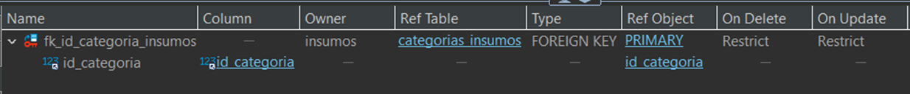
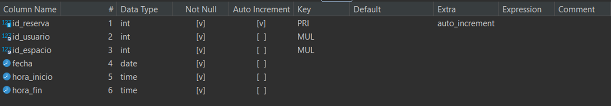

<h1 align="center">Alquiler de insumos/mobiliario para IT</h1>

<h3 align="center">Primer Entrega</h3>

<h4 align="left">
Comisión 57190
 
Prof: Anderson Michel Torres
  
Tutor: Ariel Annone
 
Alumno: Juan Manuel Danzo
 
</h4>

<h2 align="left">Objetivo</h2>

Facilitar a los profesionales del área de sistemas y tecnología el acceso a un espacio de trabajo equipado con insumos electrónicos, como computadoras, monitores, teclados, ratones y otros dispositivos. Además, proporcionar un ambiente propicio para la productividad y la colaboración, donde los usuarios puedan alquilar estos recursos según sus necesidades y horarios.
Este servicio podría beneficiar a estudiantes, freelancers, desarrolladores, diseñadores y cualquier persona que requiera un lugar cómodo y bien equipado para trabajar en proyectos informáticos.

<h2 align="left">Problematica</h2>

Los profesionales del área de sistemas, programadores y freelancers necesitan espacios de trabajo adecuados para desarrollar sus proyectos. Sin embargo, no siempre cuentan con los recursos necesarios, como computadoras de alto rendimiento, monitores, teclados ergonómicos y otros insumos electrónicos.

<h2 align="left">Solución</h2>

Crear un servicio que ofrezca alquiler de espacios de trabajo y préstamo de insumos electrónicos. Los usuarios podrán reservar escritorios, elegir entre diferentes tipos de computadoras, monitores y accesorios, y pagar solo por el tiempo que necesiten. Además, se ofrecerán servicios adicionales como café, Wi-Fi ultrarrápido y asistencia técnica básica.

<h2 align="left">Tablas</h2>
<h3 align="left">Dimensionales</h3>

* Usuarios: Almacena información sobre los usuarios que alquilen los insumos.
* Espacios: Detalles sobre los espacios de trabajo.
* Equipos: Información sobre los equipos disponibles.
* Insumos: Detalles de insumos electrónicos.
* CategoriasInsumos: Contiene la información de las categorías de insumos.

<h3 align="left">De Hecho</h3>

* Alquileres: Registra alquileres de los espacios por usuario.
* Facturas: Almacena información de la facturación de los alquileres realizados.

<h3 align="left">Transaccionales</h3>

* Reservas: Guarda información de las reservas realizadas por los usuarios.
* Prestamos_Insumos: Almacena información sobre insumos prestados a los usuarios durante un alquiler.
* Pagos: Almacena información de los pagos realizados por cada usuario durante un alquiler.

<h2 align="left">Definición de Tablas</h2>
<h3 align="center">Tabla Usuarios</h3>

<h3 align="center">Tabla Espacios</h3>

<h3 align="center">Tabla Equipos</h3>

<h3 align="center">Tabla Insumos</h3>

<h3 align="center">Tabla Alquileres</h3>

<h3 align="center">Tabla Reservas</h3>

<h3 align="center">Tabla Prestamos de Insumos</h3>

<h3 align="center">Tabla Facturas</h3>

<h3 align="center">Tabla Pagos</h3>

<h3 align="center">Tabla Categoria de Insumos</h3>

<h2 align="left">DER</h2>

<h2 align="left">Enlace Útiles</h2>
<h4 align="left">Para acceder al codigo SQL de la base de datos y las tablas haz <a href="https://github.com/panthaia/DanzoJuanManuel/blob/main/primerEntregaProyectoAlquierInsumosIT.sql" target="_blank">clic aquí</a>.</h4>
<h4 align="left">Para acceder a la presentación en PDF haz <a href="https://github.com/panthaia/DanzoJuanManuel/blob/main/src/DanzoJuanManuel.pptx" target="_blank">clic aquí</a>.</h4>
