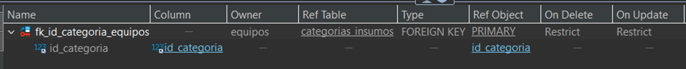
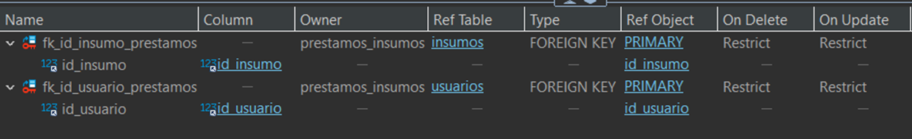
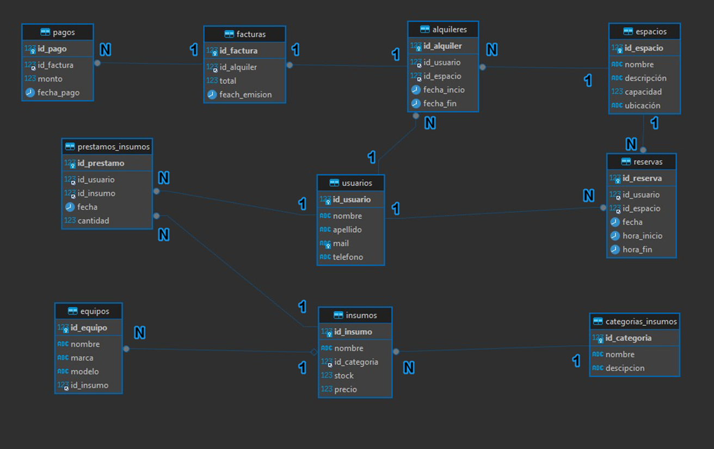

<h1 align="center">Alquiler de insumos/mobiliario para IT</h1>

<h3 align="center">Projecto Final</h3>

<p align="center" >

</p>

<h4 align="left">
Comisión 57190
<br>
Prof: Anderson Michel Torres
<br> 
Tutor: Ariel Annone
<br>
Alumno: Juan Manuel Danzo
<br>
</h4>

<h2 align="left">Objetivo</h2>

Facilitar a los profesionales del área de sistemas y tecnología el acceso a un espacio de trabajo equipado con insumos electrónicos, como computadoras, monitores, teclados, ratones y otros dispositivos. Además, proporcionar un ambiente propicio para la productividad y la colaboración, donde los usuarios puedan alquilar estos recursos según sus necesidades y horarios.
Este servicio podría beneficiar a estudiantes, freelancers, desarrolladores, diseñadores y cualquier persona que requiera un lugar cómodo y bien equipado para trabajar en proyectos informáticos.

<h2 align="left">Problematica</h2>

Los profesionales del área de sistemas, programadores y freelancers necesitan espacios de trabajo adecuados para desarrollar sus proyectos. Sin embargo, no siempre cuentan con los recursos necesarios, como computadoras de alto rendimiento, monitores, teclados ergonómicos y otros insumos electrónicos.

<h2 align="left">Solución</h2>

Crear un servicio que ofrezca alquiler de espacios de trabajo y préstamo de insumos electrónicos. Los usuarios podrán reservar escritorios, elegir entre diferentes tipos de computadoras, monitores y accesorios, y pagar solo por el tiempo que necesiten. Además, se ofrecerán servicios adicionales como café, Wi-Fi ultrarrápido y asistencia técnica básica.

<h2 align="left">Tablas</h2>
<h3 align="left">Dimensionales</h3>

* Usuarios: Almacena información sobre los usuarios que alquilen los insumos.
* Espacios: Detalles sobre los espacios de trabajo.
* Equipos: Información sobre los equipos disponibles.
* Insumos: Detalles de insumos electrónicos.
* CategoriasInsumos: Contiene la información de las categorías de insumos.

<h3 align="left">De Hecho</h3>

* Alquileres: Registra alquileres de los espacios por usuario.
* Facturas: Almacena información de la facturación de los alquileres realizados.

<h3 align="left">Transaccionales</h3>

* Reservas: Guarda información de las reservas realizadas por los usuarios.
* Prestamos_Insumos: Almacena información sobre insumos prestados a los usuarios durante un alquiler.
* Pagos: Almacena información de los pagos realizados por cada usuario durante un alquiler.


<h2 align="left">Definición de Tablas</h2>
<h3 align="center">Tabla Usuarios</h3>
<p align="center">


</p>

<h3 align="center">Tabla Espacios</h3>
<p align="center">


</p>

<h3 align="center">Tabla Equipos</h3>
<p align="center">


</p>

<h3 align="center">Tabla Insumos</h3>
<p align="center">


</p>

<h3 align="center">Tabla Alquileres</h3>
<p align="center">


</p>

<h3 align="center">Tabla Reservas</h3>
<p align="center">


</p>

<h3 align="center">Tabla Prestamos de Insumos</h3>
<p align="center">


</p>

<h3 align="center">Tabla Facturas</h3>
<p align="center">


</p>

<h3 align="center">Tabla Pagos</h3>
<p align="center">


</p>

<h3 align="center">Tabla Categoria de Insumos</h3>
<p align="center">


</p>

<h3 align="center">Tabla Registros Estado de Factura</h3>
<p align="center">

</p>

<h2 align="left">DER</h2>
<p align="center">

</p>

<h2 align="left">Vistas</h2>

<h3 align="left">Montos de los insumos alquilados:</h3>

```SQL
create view vista_monto_insumos_prestados as
select (i.precio * pi2.cantidad) as total, pi2.cantidad, i.id_insumo, pi2.id_usuario,  pi2.fecha
from insumos i 
inner join prestamos_insumos pi2
on i.id_insumo = pi2.id_insumo;
```
Esta vista se encarga de agrupar los insumos alquilados por usuarios.


El objetivo de la misma es conocer que insumos se prestaron a cada usuario y en que fecha fue el alquiler del mismo, que cantidad de los mismos se le prestaron y el valor de ese alquiler.


Las tablas que componen esta vista son Insumos y Prestamos_insumos.

<h3 align="left">Facturas por usuario:</h3>

```SQL
create view vista_factura_usuario as
select
	u.id_usuario,
	CONCAT(u.nombre,' ', u.apellido) as nombre_completo,
	f.total,
	f.fecha_emision
from
	usuarios u
inner join alquileres a
on
	u.id_usuario = a.id_usuario
inner join facturas f 
on
	a.id_alquiler = f.id_alquiler
order by u.id_usuario asc;
```

Vista que agrupo las facturas de los alquileres de los usuarios.

El objetivo de esta vista es mostrar las facturas de los alquileres que realizo cada usuario, con el nombre completo del usuario, el monto de la factura y la fecha de emisión de la misma.

Las tablas que componen esta vista son, Usuarios, Alquileres y Facturas.

<h3 align="left">Ingresos mensuales:</h3>

```SQL
create view vista_ingresos_mensuales as
select
	SUM(monto) as total,
	month(fecha_pago) as mes,
	year(fecha_pago) as anio
from
	pagos u
group by
	mes, anio
order by mes desc, anio desc;
```

Vista que agrupo los ingresos totales mensuales de los pagos realizados.

El objetivo de esta vista es mostrar los ingresos totales que hay por mes de los pagos que se hacen por los usuarios, los mismos se muestran por mes y año agrupados.

La tabla que compone esta vista es Pagos.

<h2 align="left">Funciones</h2>

<h3 align="left">Función diferencia en los pagos: </h3>

```SQL
DELIMITER $$

CREATE FUNCTION función_diferencia_pago(facturaID INT)
RETURNS char(200)
DETERMINISTIC
NO SQL
BEGIN
    DECLARE varEstado varchar(30);
    DECLARE varPrecioFac char(30);
    DECLARE varSalida char(200);

    SELECT estado INTO varEstado
    FROM resgistro_estado_facturas
    WHERE id_factura = facturaID;

    SELECT CAST(abs(precio_factura - precio_pago) AS char(30)) INTO varPrecioFac
    FROM resgistro_estado_facturas
    WHERE id_factura = facturaID;

    CASE
        WHEN varEstado = 'PAGADO' THEN
            SET varSalida = 'La factura se encuentra  Pagada';
            IF CAST(varPrecioFac AS DECIMAL) = 0 THEN
                SET varSalida = CONCAT(varSalida, ', el usuario debe: ', varPrecioFac);
            ELSE 
                SET varSalida = CONCAT(varSalida, ', el usuario tiene a favor: ', varPrecioFac);
            END IF;
        WHEN varEstado = 'PAGO_PARCIAL' THEN
            SET varSalida = CONCAT('No se completó el pago total de la factura, el usuario debe: ', varPrecioFac);
        WHEN varEstado = 'PENDIENTE_PAGO' THEN
        	SELECT CAST(precio_factura AS char(30)) INTO varPrecioFac
		    FROM resgistro_estado_facturas
		    WHERE id_factura = facturaID;
		   
            SET varSalida = CONCAT('Aún no se realizaron pagos para esta factura. Debe: ', varPrecioFac);
        ELSE
            SET varSalida = 'El valor ingresado no encontró resultados.';
    END CASE;

    RETURN varSalida;
END $$

DELIMITER ;
```

Función que se encarga de mostrar el estado de la factura de un usuario y si el mismo debe o tiene dinero a favor.

El objetivo de esta función es saber el estado de cuenta de un usuario, si tiene facturas impagas, y como esta el estado de su cuenta, si debe dinero, si no debe nada o si tiene dinero a favor.

Si la factura ingresada se encuentra en estado PAGADO se le informa al cliente que la factura esta pagada y no debe nada.
Si la factura ingresada se encuentra en estado PAGO_PARCIAL se le informa al cliente que se pago una parte de la factura y el dinero restante que debe para cancelar el total de la factura.
Si la factura ingresada se encuentra en estado PENDIENTE_PAGO se le informa al cliente que no se pago la factura y el total que debe.
Si la factura ingresada se encuentra en estado PAGADO y el cliente abono dinero de mas se le notifica el dinero a favor que tiene en su cuenta.

Las tabla involucrada en esta función es resgistro_estado_facturas.

<h2 align="left">Procedures</h2>

<h3 align="left">Calcular valor y registrar factura: </h3>

```SQL
DELIMITER $$

CREATE PROCEDURE proc_calcular_facturas(
    IN precio_alquiler DECIMAL(15, 2), 
    IN alquiler_id INT
)
BEGIN
    DECLARE facturaId INT;
    DECLARE totalFac DECIMAL(20, 2);
    DECLARE alquilerID INT;
    DECLARE facAlquilerID INT;
   
    IF precio_alquiler IS NULL THEN
    	SET precio_alquiler = 0;
    END IF;

    IF alquiler_id IS NULL THEN
       SELECT 'NO SE INGRESO UN ID DE ALQUILER.' AS OUTPUT FROM DUAL;
    ELSE
    	SELECT SUM(v1.total), a.id_alquiler INTO totalFac, alquilerID
        FROM vista_monto_insumos_prestados v1
        INNER JOIN alquileres a 
        ON a.id_usuario = v1.id_usuario
        WHERE a.id_alquiler = alquiler_id
        GROUP BY a.fecha_incio, a.id_alquiler
        ORDER BY a.id_alquiler;
    	
    	IF alquilerID IS NULL THEN
    		IF precio_alquiler = 0 THEN 
    			SELECT 'Se ingreso un alquiler sin precio, revise los datos.' AS OUTPUT FROM DUAL;
    		ELSE
    		    SELECT f1.id_alquiler INTO facAlquilerID
		        FROM facturas f1
		        WHERE f1.id_alquiler = alquiler_id;
		
		        IF facAlquilerID IS NULL OR facAlquilerID = '' THEN    		    
	    			SET totalFac = 0;
	    			INSERT INTO facturas 
	       			VALUES (NULL, alquiler_id, totalFac + precio_alquiler, NOW());
	       		ELSE
		            SELECT CONCAT('Ya existe una factura para este número de Alquiler: ', facAlquilerID) AS OUTPUT FROM DUAL;
		        END IF;	       		
    		END IF;    		
    	ELSE
	        SELECT f1.id_alquiler INTO facAlquilerID
	        FROM facturas f1
	        WHERE f1.id_alquiler = alquiler_id;
	
	        IF facAlquilerID IS NULL OR facAlquilerID = '' THEN
	            INSERT INTO facturas 
           		VALUES (NULL, alquilerID, totalFac + precio_alquiler, NOW());
	        ELSE
	            SELECT CONCAT('Ya existe una factura para este número de Alquiler: ', facAlquilerID) AS OUTPUT FROM DUAL;
	        END IF;      	
       END IF;
    END IF;
END $$

DELIMITER ;
```

Procedimiento que realiza el calculo total de una factura, sumando alquiler de espacio y de insumos y registra los datos de la misma.

El objetivo de este procedimiento es poder generar una factura enviando el valor del alquiler y el id_alquiler para calcular el total del mismo y registrar los datos de la factura en una tabla.

Si se ingresa un monto de alquiler el mismo se suma al monto total de los insumos alquilados y todo se carga como monto total en la factura, si no se ingresa monto de alquiler por el SP el mismo se carga en 0 y se suma al total de insumos alquilados.

Para el caso del ingreso del id_alquiler, si se envia un alquiler que existe y tienen insumos alquilados se hace el calculo total de lo alquilado para sumar a la factura, si se envia id_alquiler vacio, se informa por pantalla que no se ingreso un id_alquiler y si se ingresa monto e id_alquiler vacio se notifica al cliente que revise los datos ingresados.

Tablas y vistas involucradas: vista_monto_insumos_prestados, alquileres y facturas.

<h2 align="left">Triggers</h2>

<h3 align="left">Registrar estado de Factura: </h3>

```SQL
DELIMITER $$

CREATE TRIGGER tr_registrar_estado
AFTER INSERT ON facturas
FOR EACH ROW
BEGIN
    INSERT INTO resgistro_estado_facturas
    VALUES (NEW.id_factura, DEFAULT, NEW.total, null);
END $$
DELIMITER ;
```
El objetivo de este trigger es poder llevar un registro simultaneo del estado de la factura cuando se crea la misma, una ves creada la factura se registra el estado de la misma con este trigger como PENDIENTE_PAGO.

Tablas involucradas facturas y resgistro_estado_facturas.

<h3 align="left">Registrar cambio de estados de Factura: </h3>

```SQL
DELIMITER $$

CREATE TRIGGER tr_cambiar_estado
AFTER INSERT ON pagos
FOR EACH ROW
BEGIN
	DECLARE varEstado varchar(30);
	DECLARE varPrecioFac decimal(20,2);
	DECLARE varTotalPago decimal(20,2);

	SELECT estado into varEstado
	FROM resgistro_estado_facturas
	WHERE id_factura = new.id_factura;

	IF varEstado is NULL or varEstado = '' THEN 
		SELECT total into varPrecioFac
		FROM facturas f 
		WHERE id_factura = new.id_factura;
	
		IF varPrecioFac = new.monto OR varPrecioFac < new.monto THEN	
			INSERT INTO resgistro_estado_facturas
			VALUES (new.id_factura, 'PAGADO', varPrecioFac, new.monto);
		ELSE
			INSERT INTO resgistro_estado_facturas
			VALUES (new.id_factura, 'PAGO_PARCIAL', varPrecioFac, new.monto);
		END IF;
	ELSE
		SELECT sum(monto) INTO varTotalPago
		FROM pagos p 
		WHERE p.id_factura = new.id_factura;
	
		SELECT total into varPrecioFac
		FROM facturas f 
		WHERE id_factura = new.id_factura;
		IF varEstado = 'PAGO_PARCIAL' or varEstado = 'PENDIENTE_PAGO' THEN
			IF varPrecioFac = varTotalPago OR varPrecioFac < varTotalPago THEN	
				UPDATE resgistro_estado_facturas
				SET precio_pago = varTotalPago, estado = 'PAGADO'
				WHERE id_factura = new.id_factura;
			ELSE
				UPDATE resgistro_estado_facturas
				SET precio_pago = varTotalPago, estado = 'PAGO_PARCIAL'
				WHERE id_factura = new.id_factura;
			END IF;
		ELSE
			UPDATE resgistro_estado_facturas
			SET precio_pago = varTotalPago
			WHERE id_factura = new.id_factura;
		END IF;
	END IF;
END $$

DELIMITER ;
```
El objetivo de este trigger es similar al anterior, poder tener el estado de las facturas actualizado dependiendo de los datos que se ingresen de las facturas, este trigger una ves registrado un pago realiza el calculo del total del monto pagado por usuario para una factura, y en caso de ser el monto pagado igual que el monto de la factura, el estado se modifica a PAGADO, si el monto pagado es menor al monto de la factura se modifica el monto a PAGO_PARCIAL y en caso de que no exista un registro de estado y se realice el pago se inserta el dato nuevo teniendo en cuenta las comparaciones anterior, monto iguales es PAGADO y monto de pago menor a monto de facturas es PAGO_PARCIAL.

Tablas involucradas resgistro_estado_facturas, pagos y facturas.

<h3 align="left">Registrar backup de reservas eliminadas: </h3>

```SQL
DELIMITER $$

CREATE TRIGGER tr_bk_hist_reservas
AFTER DELETE ON reservas
FOR EACH ROW
BEGIN
    INSERT INTO hist_reservas_eliminadas
    VALUES (OLD.id_reserva, old.id_usuario, old.id_espacio, old.fecha, old.fecha_fin);
END $$

DELIMITER ;
```
El objetivo de este trigger tener un backup de las reservas que se eliminaron para no sobrecargar la tabla principal y guardar las reservas viejas en una tabla satelite.

Tablas involucradas reservas.

<h2 align="left">ROLES</h2>

<h3 align="left">Rol de Marketing: </h3>

```SQL
create role 'mktRol';

grant SELECT on alq_mobiliario_it.vista_factura_usuario to 'mktRol';
grant SELECT on alq_mobiliario_it.vista_ingresos_mensuales to 'mktRol';
grant SELECT on alq_mobiliario_it.vista_monto_insumos_prestados to 'mktRol';

create user 'mktUser'@'localhost' identified by 'pass123';

grant mktRol to 'mktUser'@'localhost';
```
El objetivo de este rol es permitir a la gente de marketing que puedan consultar las vistas, para obtener datos de la BD sin que intervengan en otros objetos de la BD.


<h2 align="left">Enlace Útiles</h2>
<h4 align="left">Para acceder al codigo SQL de la base de datos y las tablas haz <a href="https://github.com/panthaia/DanzoJuanManuel/blob/main/alquileInsumosIT/sql_project/estructura.sql" target="_blank">clic aquí</a>.</h4>
<h4 align="left">Para acceder al codigo SQL de la inserción de datos, funciones, triggers, funciones, procedures y roles haz <a href="https://github.com/panthaia/DanzoJuanManuel/blob/main/alquileInsumosIT/sql_project/estructura.sql" target="_blank">clic aquí</a>.</h4>
<h4 align="left">Para acceder al codigo SQL del backup haz <a href="https://github.com/panthaia/DanzoJuanManuel/blob/main/alquileInsumosIT/sql_backup/dump-alq_mobiliario_it-202408272228.sql">clic aquí</a>.</h4>
<h4 align="left">Para acceder a la presentación en PPT haz <a href="https://github.com/panthaia/DanzoJuanManuel/blob/main/alquileInsumosIT/DanzoJuanManuel.pptx" target="_blank">clic aquí</a>.</h4>
